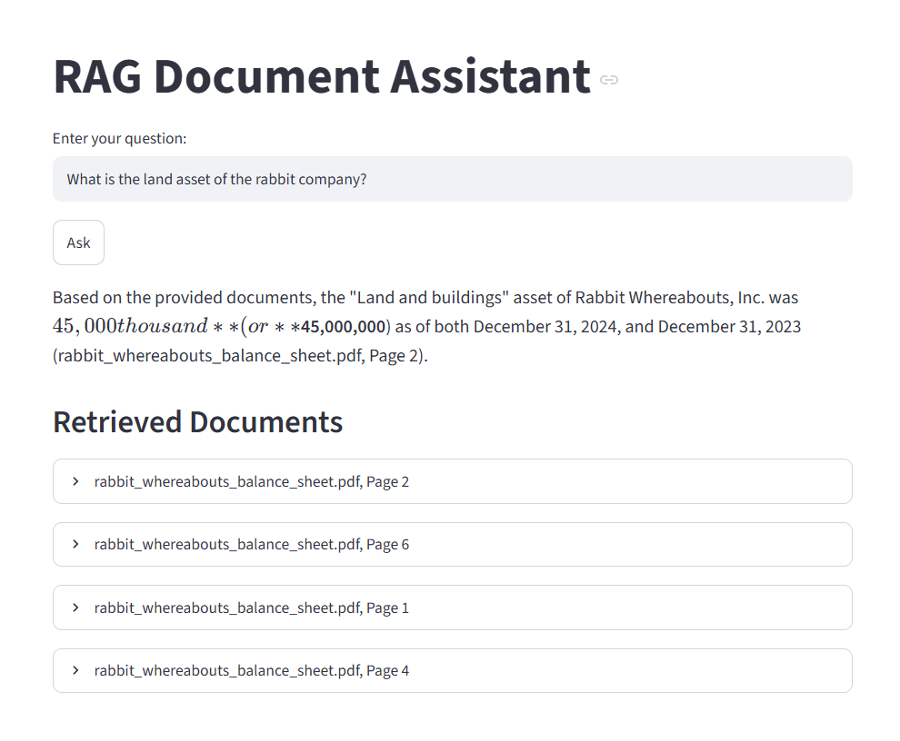

# RAG Document Assistant

A Retrieval-Augmented Generation (RAG) application that uses LangChain, Google Gemini, Hugging Face embeddings, and Streamlit to answer questions based on user-provided PDF and TXT documents.

## Screenshot

## Features

- Load PDF and TXT documents
- Split documents into smaller chunks for better retrieval
- Generate embeddings using Hugging Face
- Store embeddings in an in-memory vector store
- Retrieve the top 4 most relevant chunks
- Display similarity scores for retrieved documents
- Provide source file names and page numbers
- Generate answers using Google Gemini
- Interactive Streamlit web interface
- Display retrieved documents and their similarity scores

## RAG Pipeline

    PDF / TXT Documents
            ↓
    Document Loading
            ↓
        Chunking
            ↓
       Embeddings
            ↓
      Vector Store
            ↓
    Similarity Search
            ↓
    Retrieved Documents
            ↓
      Google Gemini
            ↓
          Answer

## Project Structure

    rag-document-assistant/
    ├── app.py
    ├── rag.py
    ├── requirements.txt
    ├── README.md
    ├── .gitignore
    ├── .env.example
    └── My Documents/
        └── .gitkeep

### Files

- `rag.py` — Core RAG logic, including document loading, chunking, embeddings, retrieval, and answer generation.
- `app.py` — Streamlit web interface.
- `requirements.txt` — Python dependencies.
- `.env.example` — Example environment variable configuration.
- `My Documents/` — Directory for local PDF and TXT documents.

## Requirements

- Python 3.10+
- Google Gemini API key

## Installation

Clone the repository:

    git clone https://github.com/PatrickR-Projects/rag-document-assistant.git
    cd rag-document-assistant

Create and activate a virtual environment:

    python -m venv venv

Windows:

    venv\Scripts\activate

Install the dependencies:

    pip install -r requirements.txt

## Environment Variables

Create a `.env` file in the project root:

    GOOGLE_API_KEY=your_api_key_here

Do not commit your `.env` file to GitHub.

## Add Documents

Place your PDF or TXT documents in:

    My Documents/

For example:

    My Documents/
    ├── document1.pdf
    ├── document2.pdf
    └── notes.txt

These documents are intentionally excluded from GitHub through `.gitignore`.

## Run the Application

Start the Streamlit application:

    streamlit run app.py

The application will open in your browser.

Enter a question and click **Ask** to retrieve relevant document chunks and generate an answer.

## Technologies

- Python
- LangChain
- Google Gemini
- Hugging Face Sentence Transformers
- InMemoryVectorStore
- Streamlit
- PyPDF

## Retrieval

The application currently uses similarity search with a **Top-K value of 4** to retrieve the most relevant document chunks.

For transparency, the Streamlit interface displays:

- Retrieved source
- Page number when available
- Similarity score
- Retrieved document content

This allows users to inspect the information retrieved by the RAG pipeline.

## Project Goal

This project demonstrates a end-to-end RAG pipeline, from document ingestion and embedding generation to semantic retrieval and LLM-powered answer generation, with a simple web interface for interacting with the system.